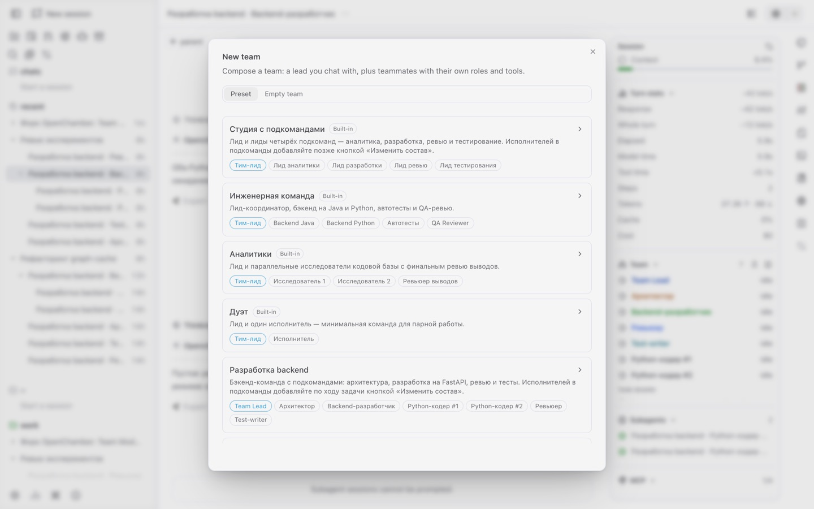
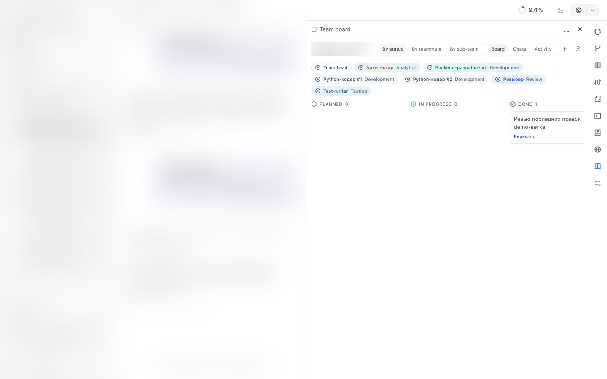
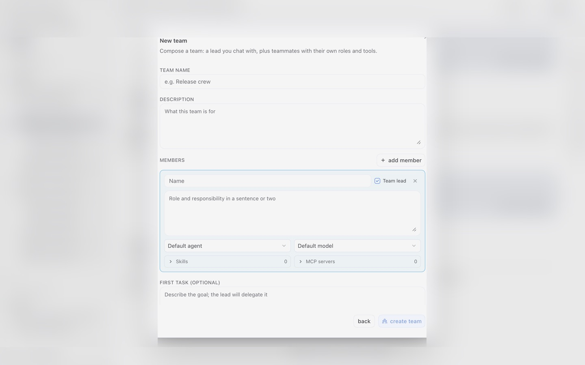
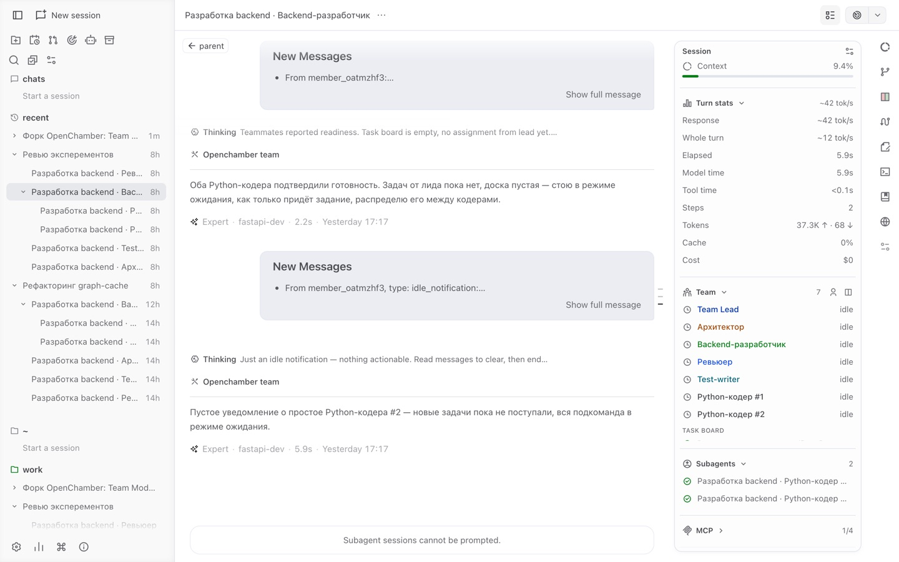
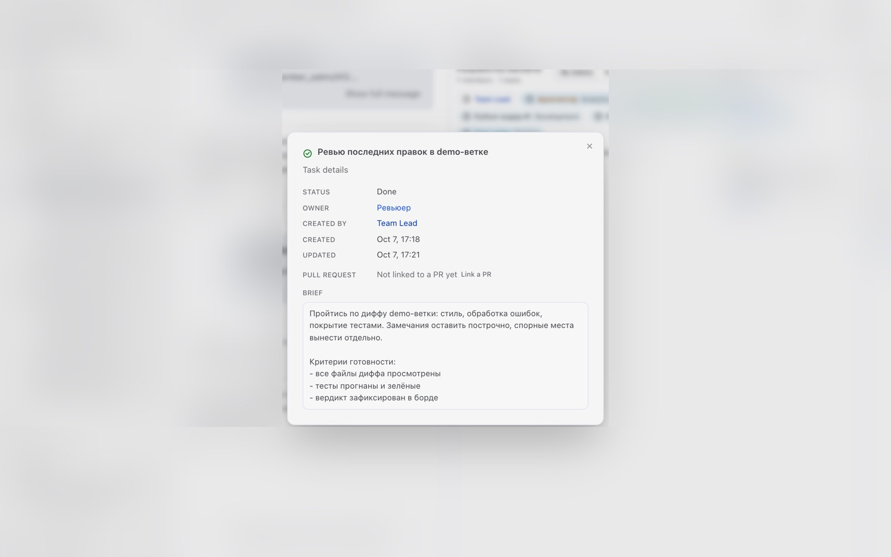
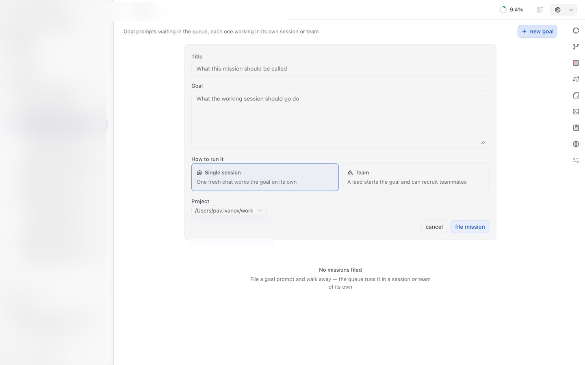
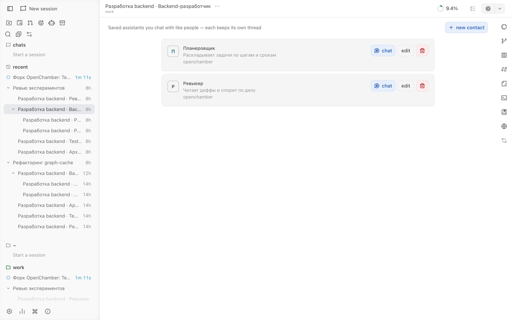
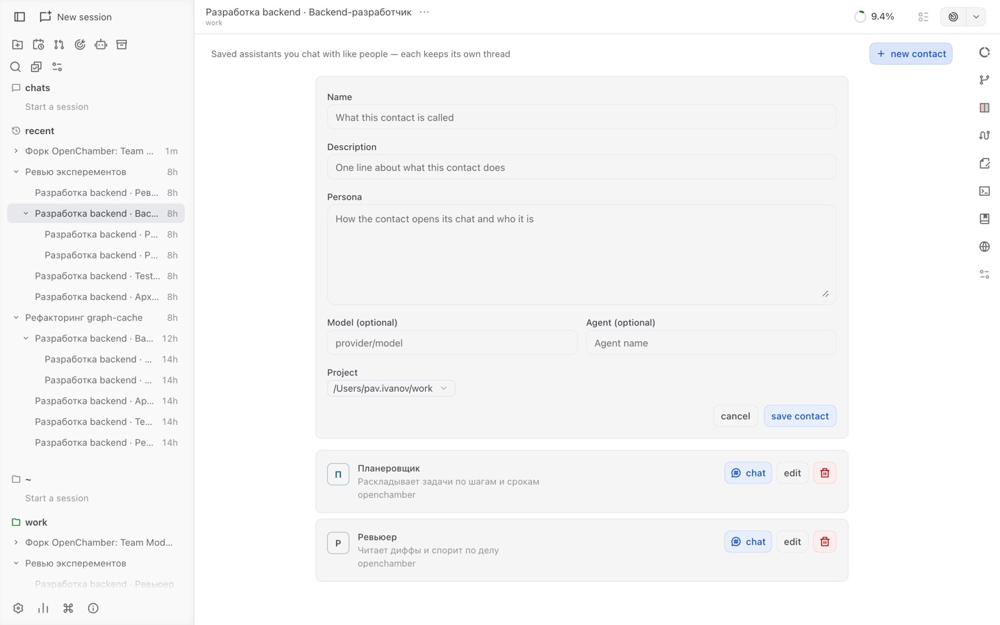

# <picture><source media="(prefers-color-scheme: dark)" srcset="docs/references/badges/openchamber-logo-dark.svg"></picture> OpenChamber

[](https://github.com/openchamber/openchamber/stargazers)
[](https://github.com/openchamber/openchamber/releases/latest)
[](https://discord.gg/ZYRSdnwwKA)
[](https://www.patreon.com/openchamber)

<a href="https://www.blacksmith.sh/"><picture><source media="(prefers-color-scheme: dark)" srcset="docs/references/badges/blacksmith-dark.svg"></picture></a>

> [!NOTE]
> **This is the team-operations fork of OpenChamber.** It builds four blocks on top of upstream, each with its own surface:
>
> - **Team Mode.** A lead you chat with plus staffed teammates: shared task board with pull-request badges, live roster, sub-teams, one activity feed.
> - **Missions.** A Goals page where a goal prompt is filed into a paced queue and run as a fresh session or a lead-led team, watched to completion.
> - **Contacts.** Saved assistant personas (a reviewer, a planner) with one continuing chat each, one click away in the sidebar.
> - **`/compactnew`.** Compact a long chat and continue in a fresh one seeded with the summary.
>
> Fork release: `2.2.0-fork1`, based on upstream `2.2.0`. The full list, commit by commit: [README-FORK.md](README-FORK.md).

## Run agent work. Keep control. Ship from anywhere.

**OpenChamber is an open-source workspace for running and reviewing AI coding work on desktop, web, VS Code, and mobile.**

Start agent work, see what changed, and take it through review and release. Your projects and sessions remain available when you switch devices or step away.


<details>
<summary>More screenshots</summary>


<p>


</p>

</details>

## Team Mode — run a team of agents, watch it from one panel

Team Mode turns sessions into a staffed team: a **lead** you chat with, plus
teammates that each own a role. The lead decomposes work onto a shared board,
teammates pick tasks up, report back, and every move stays visible from the
chat you already know.

<p>


</p>

### Create a team in one dialog

Start from a **preset** — built-in lineups (engineering crew, analysts, a duo)
or your own saved rosters — or compose an empty team. Every member gets a
name, a role brief, an agent, a model, and optional skills and MCP servers.
The optional first task is delegated by the lead as soon as the team starts.
[Details](README-FORK.md#team-mode-core--faa3ab9-480cdfa)



### The roster, alive

The work-status panel grows a **Team** section: every member with its live
state (starting, busy, idle, failed) and a stable identity color shared by
the roster, the board and the activity feed. Edit the roster of a live team —
add members, re-brief, remove — and organize them into **sub-teams**
(analytics, development, review, QA), each with its own lead.
[Details](README-FORK.md#sub-teams-and-live-roster-editing--644f61d)



### The shared task board

One board for the whole team — tasks with subject, brief, owner and
blocked-by chain, grouped **by status, by teammate, or by sub-team**. File a
task yourself with quick-add, or straight from a chat selection with the
**Team task** action. Set a `prUrl` and the card answers for its pull
request: draft or open, mergeability, CI green or failing — refreshed from
GitHub. [Details](README-FORK.md#task-details-and-portable-presets--4fe541e-30bd143-9e58674)



### Ask the lead to staff a role

Need "someone to review diffs in French" but no idea which agent fits? Ask
the lead from the roster — it proposes a named agent with a brief, and you
confirm or edit before anyone joins.
[Details](README-FORK.md#ask-the-lead-to-staff--5c96ebd)

### The team's activity, in one feed

Messages, task writes, PR changes — the team's moves in a shared, paged
activity feed with per-member colors, plus a **Chats** face that mirrors
each member's conversation. [Details](README-FORK.md#the-activity-face--c79d405)

## Missions — goals that queue themselves

A **Goals** page in the sidebar: file a goal prompt, choose how to run it —
a fresh **single session**, or a lead-led **team** whose first task it is —
and walk away. The queue runs two goals at a time, watches each working
session to completion, and survives restarts. Retry, cancel, or jump into
the working session right from the list.
[Details](README-FORK.md#missions-goals-filed-into-a-paced-queue--7695098)



## Contacts — assistants you keep like people

A **Contacts** page beside Goals: save an assistant as a persona — a name,
what it does, the prompt that defines it, optionally a model and an agent.
Each contact keeps one chat and it stays one: open the contact and the same
thread continues; if the thread was deleted, the contact starts a fresh one
seeded with its persona, so it answers as the saved role from the first
reply. [Details](README-FORK.md#contacts-saved-personas-with-one-continuing-chat--2e95232c9)

<p>


</p>

## /compactnew — long chat, fresh start

`/compact` compacts a long chat in place; `/compactnew` compacts it and
**continues in a fresh chat** seeded with the summary. The old chat stays in
the list as the archive. [Details](README-FORK.md#compactnew-continues-a-long-chat-in-a-fresh-one--eb2fa71)

## What you can do with OpenChamber

### Goals that continue on their own

Give a session a finish line with **Session Goals**. OpenChamber checks the result after every turn and keeps the agent working until it completes the goal, gets blocked, or reaches the limit you set. It can continue after you close the app.

### Compare and combine runs

Use **Multi-run** to give the same task to up to five models, each in its own session and optionally its own worktree. See what each one actually built, choose the best result, or use **Fusion** to combine the strongest parts into a new session.

### Guided changes walkthroughs

**Changes Walkthrough** turns a large diff into an AI-guided tour of the change. It groups related edits into steps, puts them in the order the change makes sense, and explains how the pieces fit together.

### Inspect a running app

Open your app beside the conversation with **Preview**. Point at an element to send the agent its screenshot, styles, position, and browser errors. No more trying to explain "this thing here." The desktop app can do the same with any web page in its built-in browser.

### GitHub context from issue to pull request

Start a session from a GitHub issue or pull request with its context attached. Send failed checks or review comments back to the agent, then update or merge the pull request from OpenChamber.

### Continue on another device

Open the same projects and sessions from Desktop, Web/PWA, VS Code, iOS, or Android. Check progress, answer questions, review changes, and reattach to a running terminal.

### Private remote access

Pair a device with a one-time QR code and connect through **Private Relay** without opening ports or exposing a public server. The connection is end-to-end encrypted and can be revoked at any time. Direct connections, LAN/VPN access, Cloudflare/Ngrok tunnels, and SSH are also supported.

### Track work across projects

See which sessions are working, waiting, finished, or failed, along with approvals, scheduled tasks, provider limits, token use, and costs. Organize sessions into folders and keep notes, todos, and reusable project actions nearby.

### Schedule recurring work

Run a prompt once, daily, weekly, or on a cron schedule. Scheduled tasks can use Session Goals, so they continue toward an outcome instead of stopping after one response.

## Use it where you work

| Surface | Role |
| --- | --- |
| **Desktop** | The complete workspace for macOS, Windows, and Linux, with multiple windows, Mini Chat, remote machines, SSH, and native notifications |
| **Web / PWA** | Open your workspace in a browser, install it as an app, and stay up to date through background notifications |
| **VS Code** | Keep sessions beside your code, send selections to the agent, open results in the editor, and compare parallel runs |
| **iOS / Android** | Review and steer work away from your desk, receive completion alerts, and use the terminal with touch controls |
| **CLI / Server** | Run OpenChamber on a workstation or server, schedule work, manage remote access, and keep it available after login |

## Quick start

### Desktop for macOS, Windows, and Linux

Download the latest release from [GitHub Releases](https://github.com/openchamber/openchamber/releases/latest). Desktop bundles the matching OpenCode CLI, so no separate OpenCode installation is required.

Linux releases are available as x86_64 and ARM64 AppImages. Make the downloaded AppImage executable and keep it in a writable location for in-app updates:

```bash
chmod +x OpenChamber-*.AppImage
./OpenChamber-*.AppImage
```

Linux AppImages require FUSE (`libfuse.so.2`). Without FUSE, run with `APPIMAGE_EXTRACT_AND_RUN=1`.

### VS Code

Install [OpenChamber from the Visual Studio Marketplace](https://marketplace.visualstudio.com/items?itemName=fedaykindev.openchamber), or search for "OpenChamber" in Extensions.

### CLI for Web and PWA

Requires Node.js 22+. CLI/Web and VS Code use your installed [OpenCode CLI](https://opencode.ai).

```bash
curl -fsSL https://raw.githubusercontent.com/openchamber/openchamber/main/scripts/install.sh | bash
openchamber --ui-password be-creative-here
```

Common operations:

```bash
openchamber status
openchamber connect-url --qr
openchamber tunnel start --provider cloudflare --mode quick --qr
openchamber startup enable
openchamber logs
openchamber stop
openchamber update
```

OpenChamber binds to localhost by default. Use `--lan` only on a trusted network and protect browser access with `--ui-password`.

## Guides

Go deeper with the OpenChamber guides:

- [Quick start](packages/docs/content/docs/quickstart.mdx)
- [Installation](packages/docs/content/docs/install.mdx)
- [Connect devices](packages/docs/content/docs/connect-devices.mdx)
- [Private Relay](packages/docs/content/docs/private-relay.mdx)
- [Multi-run](packages/docs/content/docs/multi-run.mdx)
- [Session Goals](packages/docs/content/docs/session-goals.mdx)
- [Changes Walkthrough](packages/docs/content/docs/walkthrough.mdx)
- [Preview and dev servers](packages/docs/content/docs/preview.mdx)
- [GitHub workflows](packages/docs/content/docs/github.mdx)
- [Mobile](packages/docs/content/docs/mobile.mdx)
- [Security](packages/docs/content/docs/security.mdx)
- [Troubleshooting](packages/docs/content/docs/troubleshooting.mdx)

For self-hosting details, see the [reverse proxy guide](docs/REVERSE_PROXY.md). For custom theme authoring, see the [custom themes guide](docs/CUSTOM_THEMES.md).

## Why OpenCode?

OpenChamber uses [OpenCode](https://opencode.ai) to run coding agents. We chose it because it is open source, has a solid API, and is easy to extend.

OpenChamber handles the rest of the workflow. You can decide what to try, keep the agent on track, review the result, connect from another device, and ship the change.

OpenChamber is an independent project and is not affiliated with the OpenCode team.

## Contributing

Bug fixes and small improvements are welcome as PRs. Features and behavior changes start in an [Ideas discussion](https://github.com/openchamber/openchamber/discussions/categories/ideas) so we agree on the product side before anyone writes code. Read [CONTRIBUTING.md](./CONTRIBUTING.md) before opening a PR; it has the setup, the review contract, and what happens to large unplanned PRs. Documentation authoring guidance lives in [`packages/docs`](packages/docs/README.md).

Bugs go to [issues](https://github.com/openchamber/openchamber/issues/new/choose). Questions go to [Q&A discussions](https://github.com/openchamber/openchamber/discussions/categories/q-a).

## Acknowledgments

Special thanks to:

- [OpenCode](https://opencode.ai) for the API and open-source architecture OpenChamber builds on
- [Pierre](https://pierrejs-docs.vercel.app/) for the diff viewer and syntax highlighting
- The [T3 Code](https://github.com/pingdotgg/t3code) team for their browser adapter for [libghostty-vt](https://github.com/ghostty-org/ghostty), which our terminal is built on
- [Yulia Ivashko](https://github.com/yulia-ivashko), who built the firework celebration that plays on every successful push
- Everyone who contributed code, reported bugs, or shared ideas

## License

MIT
